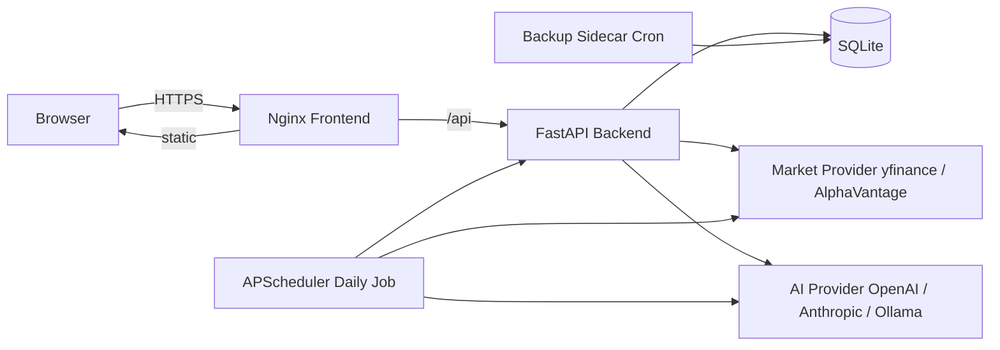
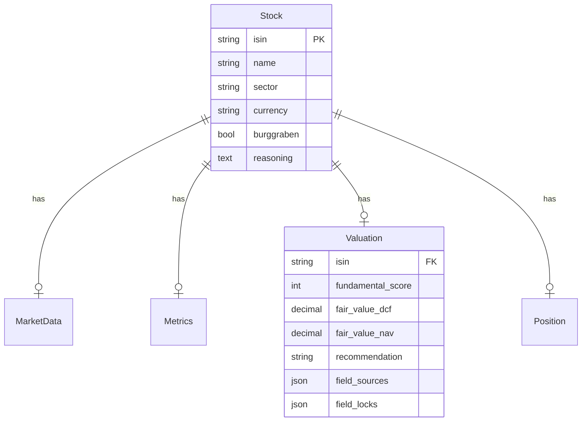
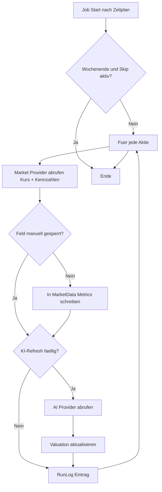

# Umsetzungsplan – CompanyTracker

Status: Entwurf v1.0
Basis: [Anforderungen.md](Anforderungen.md)
Initial-Datenquelle: [Comp_List.csv](Comp_List.csv)

Dieses Dokument beschreibt die **konkrete technische Umsetzung** des in [Anforderungen.md](Anforderungen.md) spezifizierten Aktien-Trackers. Es legt Tech-Stack, Architektur, Projektstruktur, API, Iterationen (Meilensteine) und Deployment fest.

**Primärer Produktfokus (MVP):** zuverlässige Beobachtung, wann eine Aktie günstig und qualitativ stark ist, plus nachvollziehbare BUY / RISK BUY-Empfehlung.

---

## 1. Tech-Stack (festgelegt)

| Bereich | Wahl | Begründung |
|---|---|---|
| Backend-Sprache | Python 3.12 | Beste Auswahl an Finanz- und KI-Bibliotheken (yfinance, openai, anthropic) |
| Web-Framework | FastAPI + Uvicorn | Asynchron, schnell, automatische OpenAPI-Doku |
| ORM / Migrationen | SQLAlchemy 2.x + Alembic | Standard, gute Typisierung |
| Datenbank | SQLite (Datei-basiert) | Reicht für 1–3 Nutzer und 100+ Aktien, einfaches Backup |
| Scheduler | APScheduler (in-process) | Kein zusätzlicher Dienst nötig |
| Auth | JWT (HS256) in HttpOnly-Cookies + CSRF-Token + passlib/argon2 | Klarer, sicherer Session-Ansatz im lokalen Netz |
| Kursdaten-Provider | `yfinance` als Default | Kostenfrei, gute Abdeckung; abstrahiert hinter Interface |
| Fallback-Provider | Alpha Vantage / finanzen.net-Scraper | Optional, später aktivierbar |
| KI-Provider | OpenAI / Anthropic / Ollama | Austauschbar via Settings (Strategy-Pattern) |
| Frontend-Framework | React 18 + Vite + TypeScript | Modern, große Community |
| UI-Komponenten | Tailwind CSS + shadcn/ui | Schnelle, konsistente UI |
| Tabelle | TanStack Table v8 | Sortierung, Filter, Spalten-Management out of the box |
| State / Daten | TanStack Query | Caching + automatischer Refetch |
| Charts (optional) | Recharts | Für Dashboard-Visualisierungen |
| Verschlüsselung | `cryptography` (Fernet) | Für API-Keys in der Datenbank |
| Tests | pytest (Backend), Vitest + Testing Library (Frontend) | – |
| Containerisierung | Docker + Docker Compose | Portabel, einfach auf NAS / Heim-Server |
| Web-Server (Frontend) | Nginx (Static + Reverse Proxy) | Bewährt, klein |

---

## 2. High-Level-Architektur



**Kernidee:**

- Ein einziger Backend-Prozess (FastAPI + APScheduler) – kein separater Worker im MVP
- Provider-Schicht abstrahiert externe Abhängigkeiten (Markt, KI) hinter Interfaces – austauschbar
- SQLite als lokale Datei in einem Docker-Volume – täglicher Backup-Sidecar kopiert sie weg

---

## 3. Projektstruktur

```
CompanyTracker/
  Anforderungen.md
  plan-umsetzung.md
  Comp_List.csv
  README.md

  backend/
    pyproject.toml
    app/
      main.py                # FastAPI-Instanz, Lifespan, Scheduler-Start
      core/
        config.py            # Pydantic-Settings, .env
        security.py          # JWT, Hashing
        crypto.py            # Fernet-Verschlüsselung für API-Keys
        logging.py
      db/
        base.py              # SQLAlchemy Base, Session
        session.py
      models/                # SQLAlchemy-Modelle (Stock, MarketData, ...)
      schemas/               # Pydantic-DTOs (Request/Response)
      api/
        v1/
          auth.py
          stocks.py
          jobs.py
          run_logs.py
          settings.py
          import_csv.py
          ai.py
        deps.py              # Dependency-Injection (current_user, db)
      services/
        stock_service.py
        market_service.py
        ai_service.py
        valuation_service.py # berechnete Felder
        import_service.py
        scheduler_service.py
      providers/
        market/
          base.py            # MarketProvider Interface
          yfinance_provider.py
          alpha_vantage_provider.py
        ai/
          base.py            # AIProvider Interface
          openai_provider.py
          anthropic_provider.py
          ollama_provider.py
      scheduler/
        daily_job.py
    migrations/              # Alembic
    tests/

  frontend/
    package.json
    vite.config.ts
    tailwind.config.ts
    src/
      main.tsx
      App.tsx
      router.tsx
      api/
        client.ts            # axios + interceptors (JWT)
        stocks.ts
        auth.ts
        ...
      pages/
        LoginPage.tsx
        DashboardPage.tsx
        WatchlistPage.tsx
        StockDetailPage.tsx
        SettingsPage.tsx
      components/
        WatchlistTable.tsx   # TanStack Table mit Farb-Codes
        ColorBadge.tsx
        AIProposalCard.tsx
        FilterBar.tsx
        RunLogPanel.tsx
      hooks/
      lib/
        colorRules.ts        # Schwellwerte aus Settings -> Farben

  docker/
    docker-compose.yml
    Dockerfile.backend
    Dockerfile.frontend
    nginx.conf
    backup.sh                # für Backup-Sidecar
    .env.example

  data/                       # Volume (SQLite + Backups)
    sqlite.db
    backups/
```

---

## 4. Datenmodell-Mapping

Die 9 Tabellen aus [Anforderungen.md](Anforderungen.md#8-datenmodell-abgeleitet-aus-comp_listcsv) werden als SQLAlchemy-Modelle abgebildet:

| Anforderung (8.x) | SQLAlchemy-Modell | Datei | Besonderheit |
|---|---|---|---|
| 8.1 Aktie | `Stock` | `models/stock.py` | PK = `isin`, `burggraben: bool` |
| 8.2 Kursdaten | `MarketData` | `models/market_data.py` | 1:1 zu `Stock`, `last_status` Enum |
| 8.3 Kennzahlen | `Metrics` | `models/metrics.py` | 1:1 zu `Stock` |
| 8.4 Bewertung | `Valuation` + `FieldSource` | `models/valuation.py` | Pro Feld eine Quelle (M/L/B/KI) und ein Lock-Flag |
| 8.5 Berechnete Felder | – | – | Werden zur Laufzeit aus Kurs + Valuation berechnet (View / Service), nicht persistiert; MVP-Depotlogik = investiertes Kapital (`tranchen * 1000`) |
| 8.6 Depot-Position | `Position` | `models/position.py` | PK = `isin`, `tranches: int` |
| 8.7 Lauf-Log | `RunLog` | `models/run_log.py` | JSON-Spalte `error_details` |
| 8.8 Benutzer | `User` | `models/user.py` | `password_hash`, `role` Enum |
| 8.9 Einstellungen | `AppSettings` | `models/settings.py` | Singleton (id=1), API-Keys verschlüsselt |

**Beziehungen:**



---

## 5. API-Endpunkte (REST v1)

Basis-Pfad: `/api/v1`

| Methode | Pfad | Zweck | Auth |
|---|---|---|---|
| POST | `/auth/login` | Login, JWT erhalten | Nein |
| POST | `/auth/refresh` | Token erneuern | Ja |
| GET | `/stocks` | Liste mit Filtern (sector, recommendation, burggraben, score_min, etc.) | Ja |
| POST | `/stocks` | Neue Aktie anlegen | Ja |
| GET | `/stocks/{isin}` | Detail inkl. MarketData/Metrics/Valuation/Position | Ja |
| PATCH | `/stocks/{isin}` | Aktualisieren (Stamm + manuelle Bewertung) | Ja |
| DELETE | `/stocks/{isin}` | Löschen | Ja (Admin) |
| POST | `/stocks/{isin}/refresh` | Sofort-Aktualisierung dieser Aktie | Ja |
| POST | `/stocks/{isin}/lock` | Feld(er) sperren (kein Auto-Update) | Ja |
| POST | `/jobs/refresh-all` | Manueller Trigger des Daily-Jobs | Ja |
| GET | `/run-logs` | Lauf-Historie | Ja |
| GET | `/settings` | App-Einstellungen lesen | Ja |
| PUT | `/settings` | App-Einstellungen ändern (Admin) | Ja |
| POST | `/import/csv` | Initial-Import aus `Comp_List.csv` (Multipart) | Ja (Admin) |
| GET | `/export/csv` | Watchlist als CSV exportieren | Ja |
| POST | `/ai/evaluate/{isin}` | KI-Bewertung für eine Aktie anstoßen | Ja |
| GET | `/dashboard` | Aggregierte Werte (Top-Mover, Kandidaten, Depotsumme) | Ja |

OpenAPI-Doku automatisch unter `/api/v1/docs`.

---

## 6. Scheduler & Provider-Logik

### 6.1 Daily-Job



### 6.2 Verhalten

- Default-Uhrzeit **22:30 lokal** (nach US-Börsenschluss), konfigurierbar
- **Retry**: 3 Versuche pro Aktie mit exponentialem Backoff (2 s, 4 s, 8 s)
- Einzelfehler stoppen Gesamtlauf nicht
- Wochenend-/Feiertags-Skip optional
- **KI-Cache**: timestamp-basiert (`valuation.last_ai_at`); Refresh-Intervall aus Settings (Täglich / Wöchentlich / Monatlich / Manuell)
- **Exactly-once-Ausführung**: Vor Jobstart wird ein DB-basierter Job-Lock gesetzt; läuft bereits ein Job, wird der neue Lauf abgebrochen und protokolliert

### 6.3 Provider-Interface (Beispiel)

```python
class MarketProvider(Protocol):
    async def fetch_quote(self, isin: str, ticker: str | None) -> Quote: ...
    async def fetch_metrics(self, isin: str, ticker: str | None) -> Metrics: ...
```

```python
class AIProvider(Protocol):
    async def evaluate(self, stock: Stock, metrics: Metrics) -> AIEvaluation: ...
```

---

## 7. Frontend-Seiten

| Seite | Route | Inhalt |
|---|---|---|
| Login | `/login` | Username/Password, Access-/Refresh-Token in HttpOnly-Cookies; CSRF-Token für schreibende Requests |
| Dashboard | `/` | KPIs (Depotwert, Tagesveränderung, Anteil Burggraben), Top-Gewinner/-Verlierer, Kaufkandidaten, Status letzter Lauf |
| Watchlist | `/watchlist` | TanStack Table mit allen Spalten, Filterleiste, Farb-Codes gem. [Anforderungen.md §9](Anforderungen.md#9-visualisierungsregeln-ampelsystem), CSV-Export, "Jetzt aktualisieren"-Button |
| Aktien-Detail | `/stocks/:isin` | Stammdaten, Kursverlauf (optional Recharts), Kennzahlen, KI-Vorschläge mit *Übernehmen / Verwerfen / Sperren*, externe Links, Begründungs-Editor, Tranchen-Editor |
| Einstellungen | `/settings` | Update-Uhrzeit, Wochenend-Skip, KI-Provider/Endpoint/Key/Modell, Refresh-Intervall, Schwellwerte (Farb-Codes), Benutzerverwaltung (Admin) |
| Lauf-Log | `/runs` | Letzte Läufe mit Dauer, Erfolge, Fehlern (drill-down) |

**Farb-Logik:** zentral in `lib/colorRules.ts`, nimmt aktuelle Werte + Schwellwerte aus Settings entgegen und liefert Tailwind-Klassen (z. B. `bg-green-200`, `bg-red-200`, `bg-blue-200`, `bg-cyan-200`, `bg-purple-200`).

---

## 8. Meilensteine / Iterationen

Geschätzter Aufwand pro Meilenstein in **Personentagen (PT)** für 1 Entwickler.

| ID | Inhalt | Aufwand | Priorität |
|---|---|---|---|
| **M1** | Setup: Mono-Repo-Struktur, `docker-compose.yml`, FastAPI-Skeleton (Health, Settings), React-Skeleton (Vite+Tailwind), Login + JWT, User-Modell, Alembic-Init | 3 PT | MVP |
| **M2** | Stock-CRUD (Backend + UI), CSV-Importer für `Comp_List.csv` inkl. Mapping (Burggraben-Flag aus altem Burggraben-Depot, Tranchen aus beiden Excel-Spalten addiert) | 3 PT | MVP |
| **M3** | Market-Provider-Interface, `yfinance`-Implementierung, ISIN→Ticker-Mapping (mit manuellem Override-Feld), `POST /stocks/{isin}/refresh`, Manuell-Aktualisieren-Button im UI | 3 PT | MVP |
| **M4** | Watchlist-UI: TanStack Table, Filter, Sortierung, Spalten-Auswahl, Farb-Codes gemäß [Anforderungen §9](Anforderungen.md#9-visualisierungsregeln-ampelsystem), CSV-Export | 4 PT | MVP |
| **M5** | APScheduler-Daily-Job, RunLog-Modell + UI (`/runs`), Retry-Logik, Wochenend-Skip-Option, DB-Job-Lock | 2 PT | MVP |
| **M6** | Kennzahlen-Erweiterung: KGV (aktuell, min/max/Ø 5J), Dividende, Analysten-Kursziel, Marktkap, EK-Quote, Umsatzwachstum aus yfinance, Anzeige in Tabelle und Detail | 3 PT | MVP |
| **M7** | Berechnete Felder (DCF/NAV-Über-/Unterbewertung, Abstand Kursziel, investiertes Kapital), Dashboard-Seite mit Aggregaten | 3 PT | MVP |
| **M8** | KI-Provider-Interface, OpenAI- + Ollama-Implementierung, Bewertungs-Service (Burggraben, DCF, NAV, Empfehlung, Risiken), AIProposalCard im Detail mit Übernehmen/Verwerfen/Sperren, Caching gemäß Refresh-Intervall, Token/Kosten-Anzeige | 5 PT | MVP |
| **M9** | Einstellungen-UI: KI-Konfiguration, Schwellwerte für Farb-Codes, Benutzerverwaltung (Admin), API-Key-Verschlüsselung mit Fernet | 2 PT | MVP |
| **M10** | Backup-Sidecar (täglicher SQLite-Dump, 14 Tage rollierend), Härtung: Tests, strukturierte Logs, README mit Setup/Update/Backup-Restore | 3 PT | MVP |
| **M11** | Kauf-/Verkaufs-Historie (Transaktionsjournal inkl. Kaufdatum, Menge, Preis, Gebühren) | 4 PT | Später |

**Summe MVP: ca. 31 PT** (≈ 6–7 Wochen bei einem Entwickler in Teilzeit).
**Phase "Später" (M11): ca. 4 PT.**

### 8.1 Abnahmekriterien je Meilenstein

| ID | Abnahmekriterien (Done, messbar) |
|---|---|
| M1 | `docker compose up -d` startet fehlerfrei; `/api/v1/health` liefert 200; Login erzeugt gültige Session-Cookies |
| M2 | CSV-Import legt bei gültiger Datei alle ISINs ohne Duplikate an; Stock-CRUD in UI und API funktionsfähig |
| M3 | `POST /stocks/{isin}/refresh` aktualisiert Kurs + `last_updated`; fehlendes Ticker-Mapping wird im Log sichtbar |
| M4 | Watchlist unterstützt Sortierung/Filter pro Spalte; gespeicherte Presets funktionieren; CSV-Export ist nutzbar |
| M5 | Geplanter Job läuft zur konfigurierten Uhrzeit; genau eine Job-Instanz gleichzeitig (DB-Lock); RunLog zeigt Erfolgs-/Fehlerzahlen |
| M6 | Kennzahlenfelder aus Provider werden je Aktie angezeigt; fehlende Werte sind als `missing` markiert statt still leer |
| M7 | Unter-/Überbewertung DCF/NAV und Kursziel-Abstand werden korrekt berechnet; Dashboard zeigt Kaufkandidaten und Summen |
| M8 | KI-Bewertung pro Aktie ausführbar; Übernehmen/Verwerfen/Sperren funktioniert; Cache-Intervall verhindert unnötige Re-Calls |
| M9 | Änderungen an KI-/Farb-Einstellungen wirken ohne Neustart; API-Key wird verschlüsselt gespeichert und entschlüsselt nutzbar geladen |
| M10 | Tägliche Backups werden erzeugt und auf 14 Versionen rotiert; Restore-Test aus Backup startet System wieder lauffähig |
| M11 | Transaktionsjournal unterstützt Create/Read/Update/Delete; Performance je Position ist aus Transaktionen ableitbar |

---

## 9. Deployment

### 9.1 Docker Compose

`docker/docker-compose.yml`:

- **backend** (Python/FastAPI/Uvicorn) – Port intern 8000, Volume `./data:/data`
- **frontend** (Nginx mit gebauten React-Assets + Reverse-Proxy auf `/api` → backend) – Port 8080 nach außen
- **backup** (Alpine + Cron) – täglich `sqlite3 .backup`, behält 14 Versionen

### 9.2 Konfiguration

`.env` aus `docker/.env.example`:

```
APP_SECRET_KEY=...
JWT_SECRET=...
ENCRYPTION_KEY=...      # Fernet-Key für API-Keys
DEFAULT_ADMIN_USER=admin
DEFAULT_ADMIN_PASSWORD=changeme
TZ=Europe/Berlin
```

### 9.3 Betrieb

- Start: `docker compose up -d`
- Update: `git pull && docker compose build && docker compose up -d` (Migrationen laufen beim Start)
- Logs: `docker compose logs -f backend`
- Backup-Restore: SQLite-Datei aus `data/backups/` zurückkopieren, Container neu starten

### 9.4 Health & Monitoring

- `/api/v1/health` Endpoint (Liveness)
- Healthcheck in Docker Compose
- Restart-Policy: `unless-stopped`

---

## 10. Risiken & Annahmen

| Risiko | Maßnahme |
|---|---|
| `yfinance` instabil oder API-Bruch | Provider-Abstraktion, Fallback Alpha Vantage konfigurierbar |
| Hohe KI-Kosten | Default-Refresh **monatlich**, Caching, Token-Anzeige, manueller Trigger |
| ISIN ↔ Ticker-Mapping fehlerhaft | Manuelles `ticker_override`-Feld pro Aktie |
| Scraping (finanzen.net/onvista) rechtlich grenzwertig | Standardmäßig **deaktiviert**, nur als optionaler Fallback |
| SQLite-Korruption | Tägliches Backup + WAL-Mode |
| Verlust API-Keys bei DB-Klau | Verschlüsselung mit Fernet, Key in `.env` (nicht in DB) |
| Doppelter Joblauf bei Restart/Mehrinstanz-Betrieb | DB-Job-Lock (exactly-once), idempotente Verarbeitung, RunLog zur Nachvollziehbarkeit |

---

## 11. Geschätzter Aufwand (Übersicht)

| Phase | PT |
|---|---|
| MVP (M1–M10) | 31 |
| Später (M11) | 4 |
| Puffer / Bugfixing (~20 %) | 6 |
| **Gesamt inkl. M11** | **~41 PT** |

---

## 12. Nicht im Scope (MVP)

- **Kauf-/Verkaufs-Historie im MVP** (als Phase "Später" in M11 geplant)
- Mobile-App / native Clients
- Push-/E-Mail-Benachrichtigungen bei Kursauffälligkeiten
- Public-Internet-Zugriff (HTTPS via Reverse-Proxy außerhalb des Heimnetzes)
- Mehr-Mandanten-Fähigkeit
- Echtzeit-Kurse (Streaming) – Tagesschluss reicht laut Anforderung

---

*Ende des Dokuments.*
